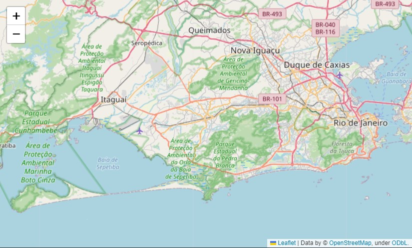
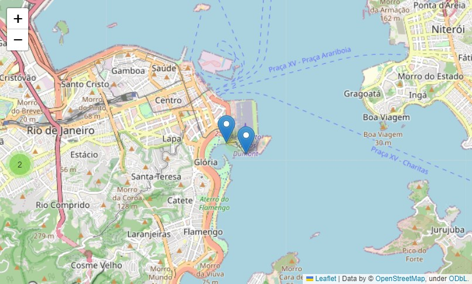
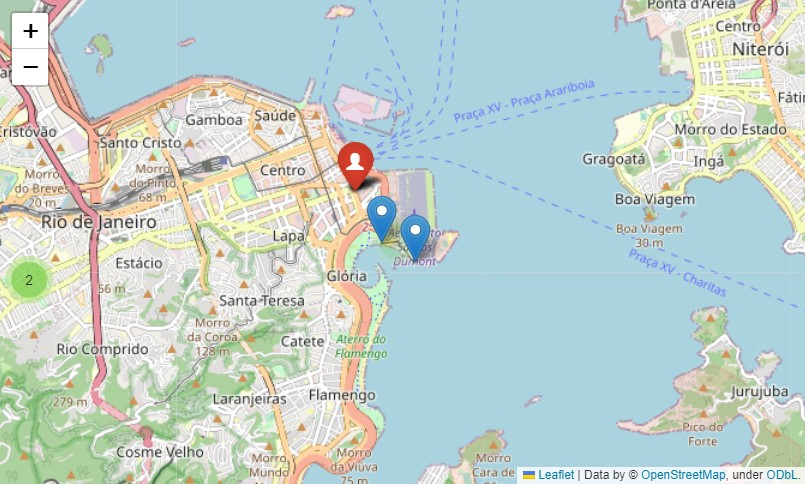
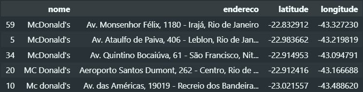
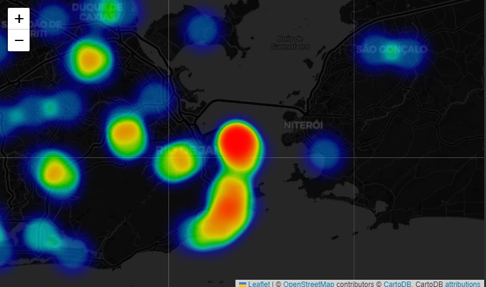
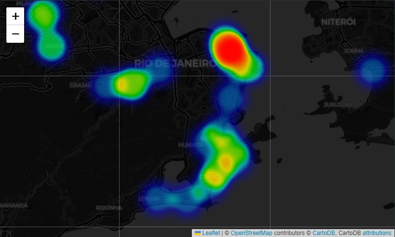
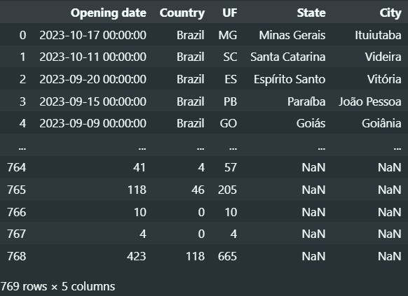
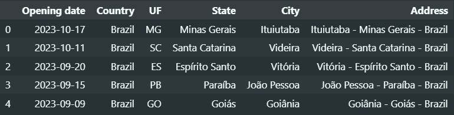
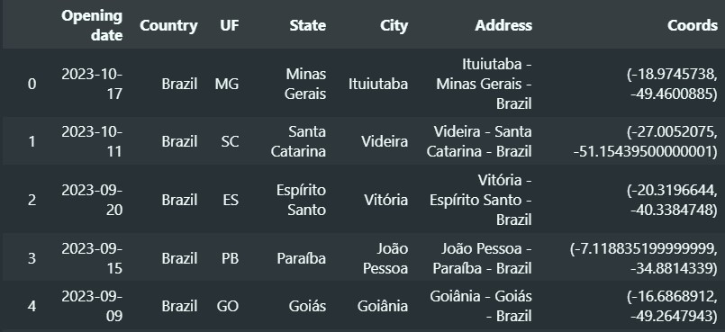
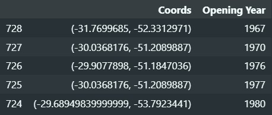

# Folium: Criando mapas interativos com dados reais de forma simples
<center></center>

> Folium é uma poderosa biblioteca Python que combina as a capacidades do ecossistema com a versatilidade da biblioteca Leaflet.js. Com o Folium podemos facilmente buscar, tratar e manipular nossos dados em python e, em seguida, visualiza-los de maneira interativa em um mapa Leaflet.

[https://python-visualization.github.io/folium/latest/index.html](https://python-visualization.github.io/folium/latest/index.html)

>No repositório é possível encontrar os arquivos utilizados durante o estudo. Também existe o link para a visualização do jupter notebook online na [área de links](#links-e-agradecimentos).

Neste artigo vamos trabalhar exibindo dados com algumas ferramentas do Folium: 

- Criação do mapa interativo centralizado em uma coordenada geográfica
- MarkerCluster: posiciona um marcador na coordenada passada; agrupa marcadores próximos de acordo com o zoom
- HeatMap: cria um ponto de calor na coordenada passada; Possibilita identificar onde possui a maior intensidade de pontos pela cor
- HeatMapWithTime: Cria uma linha temporal em mapas de calor

### Instalação

A biblioteca Folium pode ser facilmente instalada usando o comando:

`$ pip install folium`

Se você está usando o Conda, o equivalente é

`$ conda install folium -c conda-forge`

### Dependências

O Folium tem as seguintes dependências: branca, Jinja2, Numpy e Requests, que serão instaladas automaticamente com o comando de instalação.
## **Criando um mapa**

Esse é o exemplo mais simples para a criação de um mapa:

```python
import folium

m = folium.Map(location=(-22.9140008, -43.563634))
```

Pronto, está criado! Mas como podemos ver?

Se estivermos em um Jupyter Notebook, podemos visualizar facilmente chamando a instancia:

```python
m
```

<center></center>

Para visualiza todos os mapas interativos acesse o notebook no final do arquivo.

Ou podemos salvar como HTML:

```python
m.save("index.html")
```

Podemos também mudar o tipo de mapa que é exibido facilmente adicionando o argumento “tiles” e o tipo de mapa. Por padrão é carregado o tileset *OpenStreetMap* porem vamos ver como fica utilizando o *cartodb positron*

```python
m = folium.Map(location=(-22.9140008, -43.563634), tiles="cartodb positron")
m
```

<center></center>

Agora que entendemos um pouco sobre a criação do mapa com o Folium, vamos trabalhar com algumas ferramentas que ele disponibiliza para a visualização dos nossos dados!

Mas antes de iniciar, vamos carregar todas as libs:

```python
import folium, googlemaps, time
from folium.plugins import HeatMap, MarkerCluster, HeatMapWithTime
import pandas as pd
```

## MarkerCluster

Para utilizar essa primeira ferramenta, pensei em trabalhar com dados reais, como por exemplo: Quais são os Mc Donald’s mais próximos que estão abertos nesse momento?

Podemos conseguir esses dados de maneira fácil utilizando a biblioteca `googlemaps`.

Instanciando o `googlemaps` com a chave API:

```python
client = googlemaps.Client(chave_api)
```

> Caso não tenha uma chave de api do google clouds, crie uma por aqui [https://cloud.google.com/?hl=pt-BR](https://cloud.google.com/?hl=pt-BR), após criar uma, ative as API’s: Places e Geocoding.
 

Não tem uma chave mas quer acompanhar o tutorial? Todas as respostas recebidas pela API estão disponíveis no repositório. Carregue-as da seguinte maneira:

```python
 import json
 with open("responses/01-geocode-response.json", "r") as file:
        response = json.load(file)

# substitua a requisição à api pelas linhas acima
# lembre de alterar o nome do arquivo
```

Utilizando o método `geocode` e passando uma string referente a um endereço, nos é retornado um dicionário repleto de informações. Vamos trabalhar nesse momento somente com as coordenadas.

```python
endereco = "rio de janeiro, rj, brasil"
coords_endereco = client.geocode(endereco)[0]["geometry"]["location"]

coords_endereco
# {'lat': -22.9068467, 'lng': -43.1728965}
```

A partir dessa coordenada, vamos fazer uma busca pelos estabelecimentos próximos definindo uma query que, no nosso caso vai ser "*Mc Donald’s*"

```python
lista_coordenadas = []
keyword = "Mc Donalds"
response = client.places(query=keyword, location=coords_endereco, open_now=True)

for result in response["results"]:
        latitude = result["geometry"]["location"]["lat"]
        longitude = result["geometry"]["location"]["lng"]
        lista_coordenadas.append([latitude, longitude])

lista_coordenadas[0]
# [-22.9137805, -43.1666602]
```

### Criando o mapa e adicionando os marcadores

Com os dados em mãos, podemos inserir em um mapa da seguinte forma:

```python
mapa = folium.Map(location= lista_coordenadas[0], zoom_start= 13)
marker = MarkerCluster().add_to(mapa)

MarkerCluster(locations=lista_coordenadas).add_to(mapa)
mapa.save('mcdonalds_nearby_marker.html')
mapa
```

<center></center


Dessa vez definimos um zoom inicial para o nosso mapa com o `zoom_start=13`

O argumento `locations` recebe uma lista de coordenadas e para cada uma delas insere um marcador no respectivo local do mapa.

Podemos também estilizar o marcador, com os argumentos: 

```python
folium.Marker(
    location=[-22.9068467, -43.1728965],
    tooltip="Rio de Janeiro",
    popup="Informações",
    icon=folium.Icon(icon="user", color="red"),
).add_to(mapa)
mapa
```
<center></center


Veja mais opções em: [https://github.com/lennardv2/Leaflet.awesome-markers](https://github.com/lennardv2/Leaflet.awesome-markers) e [https://fontawesome.com/search?s=solid&f=classic&o=r](https://fontawesome.com/search?s=solid&f=classic&o=r)

Podemos então concluir que é bem simples apresentar esses dados em um mapa, permitindo uma exploração interativa para análises e insights geográficos. Mas vamos explorar mais algumas ferramentas. Dessa vez vamos tentar com um mapa de calor.

## HeatMap

Um gráfico de calor em um mapa, pode nos ajudar a obter informações valiosas. O mapa de calor facilita a identificação de repetições e padrões em coordenadas geoespaciais.

Para exemplificar com dados reais um mapa de calor, vamos buscar as coordenadas de todos os *Mc Donald’s* de uma cidade. Vamos fazer uma busca parecida com a anterior, porém com um raio maior. Também vamos coletar um pouco mais de dados da resposta, para limpar e refinar os resultados. E para isso, nada melhor que usar o amigo do analista de dados, sim, estou falando do `Pandas`. 🐼

Vamos começar fazendo uma nova requisição, utilizando agora o `places_nearby()` para definir um raio maior de busca.

```python
lista_dfs = []
keyword = "Mc Donalds"
response = client.places_nearby(location=coords_endereco, keyword=keyword, radius=50000)

while True:
    time.sleep(0.1)

    for store in response["results"]:
        df = pd.DataFrame(
            {
                "nome": store["name"],
                "endereco": store["vicinity"],
                "latitude": store["geometry"]["location"]["lat"],
                "longitude": store["geometry"]["location"]["lng"],
            },
            index=[0],
        )
        lista_dfs.append(df)

    if "next_page_token" in response:
        next_page_token = response["next_page_token"]
        time.sleep(2.3)
        response = client.places_nearby(
            location=coords_endereco,
            keyword=keyword,
            radius=50000,
            page_token=next_page_token,
        )

    else:
        break

df_resultados = pd.concat(lista_dfs, ignore_index=True)
df_resultados.sample(5)
```

<center></center>

- Como são muitos resultados, a API divide-os em páginas e envia na resposta um token para a próxima.
- Após a primeira requisição é iniciado um loop infinito, que é interrompido quando não tem mais páginas. Dentro do loop é iniciado um for loop que itera por cada resultado da página, criando um dataframe para cada um.
- Caso a página tenha um token para a próxima página, é feito uma nova requisição incluindo esse token como argumento.
- Por fim, fazemos uma concatenação de DataFrames com `pd.concat()`

> Importante: Evite utilizar o método concat() dentro de loops, isso pode resultar em uma grande perca de eficiência. Para casos como esse, guarde os DataFrames em uma lista temporária e, ao final do loop, utilize o pd.concat() para unir todos os DataFrames da lista.
> 

### Tratando os dados

Após criar o DataFrame com todos os resultados, podemos trata-los para remover possíveis resultados indesejados ou duplicados.

E com os dados limpos, podemos salvar apenas o que nos interessa: as coordenadas.

```python
lojas_mc_filtrado = df_resultados[
    (df_resultados["nome"].str.lower().str.contains("mcdonald"))
    | df_resultados["nome"].str.lower().str.contains("mc donald")
]
lojas_mc_filtrado = lojas_mc_filtrado.drop_duplicates(subset="endereco")

lista_coordenadas = lojas_mc_filtrado[['latitude', 'longitude']].values

print('Quantidade de resultados:', len(lista_coordenadas))
# Quantidade de resultados: 60
print('Exemplo de resultado:', lista_coordenadas[0])
# Exemplo de resultado: [-22.9056077 -43.1761831]
```

### Plotando os dados no mapa

Agora vamos utilizar o plugin HeatMap para criar os pontos de calor e em seguida adicionar no mapa com a função `add_to()`

```python
map_calor = folium.Map(location=list(coords_endereco.values()), zoom_start=11, tiles="Cartodb dark_matter",)
HeatMap(lista_coordenadas, radius= 30).add_to(map_calor)
map_calor.save('mcdonalds_heatmap.html')
map_calor
```

<center> </center>


Com dados parecidos aos anteriores porém em maior escala podemos identificar facilmente pontos de maior cobertura dos restaurantes.

## HeatmapWithTime

O mapa de calor com tempo possibilita visualizar de uma forma dinâmica como os pontos do mapa evoluem ao longo do tempo. Esse recurso é amplamente utilizado em diversas áreas, como na analise de tráfego de veículos ao longo do dia ou mapeamento de jogadores em esportes ao longo das partidas, entre muitos outros exemplos.

Para exemplificar essa ferramenta vamos trabalhar usando a data de abertura das lojas da empresa renner (disponibilizadas publicamente em seu site: [https://lojasrenner.mzweb.com.br/](https://lojasrenner.mzweb.com.br/)) e analisar o avanço da cobertura da empresa pelo país ao longo do tempo.

### Carregando e tratando dados

Partindo do zero: vamos puxar todos os dados da planilha com a função `pd.read_excel()`. 

- Com o argumento `sheet_name` devemos passar o nome referente a aba que contem a lista de lojas.
- Em `skiprows` vamos passar quantas linhas devemos pular de cabeçalho
- E finalmente em `usecols`, selecionaremos as colunas que vamos começar a trabalhar

```python
df = pd.read_excel(
    "Planilhas e Fundamentos .xlsm", 
    sheet_name= 'Lista de Lojas | Stores List', 
    skiprows= 5,
    usecols = ['Opening date', 'Country', 'UF', 'State', 'City'])

df_renner = df.copy()
df_renner
```

<center></center>

> Pessoalmente gosto de criar copias de requisições ou de dataframes carregados de arquivos para não precisar executar a operação novamente caso faça algo errado durante a analise.
> 

```python
# removendo dados faltantes
df_renner.dropna(inplace= True)

# tratando a data de abertura
df_renner['Opening date'] = pd.to_datetime(df_renner['Opening date']) 

# filtrando o pais
df_renner = df_renner[df_renner['Country'] == 'Brazil']

# criando uma coluna com endereco
df_renner['Address'] = df_renner.apply(lambda row: f"{row['City']} - {row['State']} - {row['Country']}", axis= 1)

df_renner.head(5)
```

<center></center>

Com os dados do endereço agora podemos fazer uma requisição ao `geocode` para obter as coordenadas do local e salvar em uma nova coluna.

```python
def get_coords(address): return client.geocode(address)[0]['geometry']['location']
df_renner['Coords'] = df_renner['Address'].apply(lambda coords: tuple(get_coords(coords).values()))

df_renner_copia = df_renner.copy()
df_renner.head(4)
```

<center></center>


A partir desse df, deixaremos somente o que vamos precisar para criar os marcadores no mapa: as coordenadas e o ano de abertura da loja.

```python
# criando uma coluna com o ano
df_renner['Opening Year'] = df_renner['Opening date'].dt.year

# removendo dados desnecessários
df_renner = df_renner.drop(['Country', 'UF', 'State', 'City', 'Opening date', 'Address'], axis=1)

# ordenando pelo ano
df_renner = df_renner.sort_values(by='Opening Year')

df_renner.head(5)
```

<center></center>

Estamos quase lá, para criarmos o mapa de calor com linha do tempo precisamos criar uma `data` e um `index`. O `index` é uma lista com marcadores, para o nosso caso usaremos uma lista com todos os anos passados da abertura da primeira loja até o ano atual. Para a `data`, precisamos criar uma lista do mesmo tamanho do index, com coordenadas ou listas de coordenadas. 

Vamos fazer alguns loops percorrendo o `index` e identificar qual loja está aberta e qual está fechada. Também podemos atribuir uma intensidade, de 0 à 1 junto com a coordenada. Criaremos uma definição de quanto mais tempo a loja está aberta, maior será a força.

```python
# criando o index de anos
primeiro_ano = df_renner["Opening Year"].min()
ultimo_ano = df_renner["Opening Year"].max()
year_index = list(range(primeiro_ano, ultimo_ano))
year_index.append(ultimo_ano)

coords_time_line = []
for year in year_index:
    lojas_coordenadas_por_ano = []
    for index, row in df_renner.iterrows():
        # calcula o tempo que a loja está aberta
        year_diff = year - row["Opening Year"]

        # caso seja menor que zero, não é adicionada ao mapa
        if year_diff < 0:
            pass
        else:
            # adicionando uma lista com as cordenadas e a intensidade
            coord = [row["Coords"][0], row["Coords"][1]]

            # para ilustrar, podemos criar uma definição de força de acordo com
            # a idade da loja
            if year_diff == 0:
                coord.append(0.5)
            elif year_diff == 1:
                coord.append(0.7)
            elif year_diff > 1:
                coord.append(1)

            lojas_coordenadas_por_ano.append(coord)

    coords_time_line.append(lojas_coordenadas_por_ano)
```

Por fim, estamos com duas variáveis: `year_index` e `coords_time_line`, as duas com o mesmo tamanho. Agora basta criar o mapa:

```python
mapa_renner = folium.Map(location=[-17, -50], zoom_start=4)
HeatMap = HeatMapWithTime(
    data=coords_time_line,
    index=year_index,
    auto_play=True,
    max_opacity=0.3,
    name="Datas",
    blur=1,
    min_speed=1,
).add_to(mapa_renner)
mapa_renner
```


Com o HeatMapWithTime, também configuramos mais algumas coisas, como opacidade máxima, blur e velocidade mínima. 

## Conclusão

O folium ainda oferece outras funcionalidades além das abordadas nesse artigo. Mas com uma exemplificação breve de algumas de suas ferramentas podemos perceber o potencial da biblioteca para análise e geração de insights a partir de dados geoespaciais. 

Aliado a outras ferramentas para obtenção e manipulação de dados, o Folium se torna peça chave em um conjunto para a análise e visualização de dados. Sua leveza e baixa dificuldade para gerar mapas interativos possibilitam uma análise exploratória e explanatória eficaz.

### **Referências**

[https://python-visualization.github.io/folium/latest/](https://python-visualization.github.io/folium/latest/)

[https://lojasrenner.mzweb.com.br/](https://lojasrenner.mzweb.com.br/)

### Links e Agradecimentos

[Jupyter Notebook Google Colab](https://colab.research.google.com/drive/1AEf6BUQHY4TFrGWWuBS5RmLsmkhJy6mA?usp=sharing)

[Moscarde/FoliumTools](https://github.com/Moscarde/FoliumTools)

[Perfil no LinkedIn](https://www.linkedin.com/in/moscarde/)

[Perfil no GitHub](https://github.com/Moscarde/)

[Postagem Medium](https://moscarde.medium.com/folium-criando-mapas-interativos-com-dados-reais-de-forma-simples-c20ab89b5c79)

Se você leu até esse ponto, muito obrigado. Esta é minha primeira publicação, Fique à vontade para me seguir nas outras redes sociais e, se possível me conte o que achou do conteúdo. =)

Um agradecimento especial ao [Henrique W. Franco](https://medium.com/u/1f3cc85024dc?source=post_page-----c20ab89b5c79--------------------------------)
que me inspirou fortemente com diversos estudos de extrema qualidade.